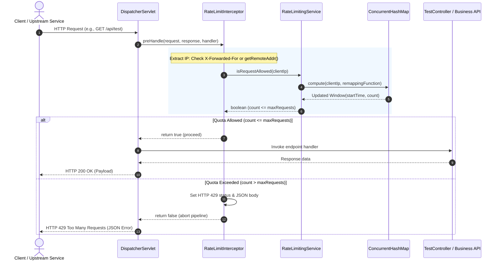

# System Architecture & Design
## GateKeeper: Traffic Analyzer & Rate Limiter System

---

## 1. High-Level Architectural Overview
GateKeeper is integrated directly into the Spring Web MVC request processing pipeline. Operating as a `HandlerInterceptor`, it enforces non-blocking admission control prior to controller dispatching.

```
       [ Client Request ]
               │
               ▼
     [ DispatcherServlet ]
               │
               ▼
    [ RateLimitInterceptor ] ──(Block: count > max)──► [ HTTP 429 JSON Response ]
               │
        (Allow: count <= max)
               │
               ▼
       [ @RestController ]
```

---

## 2. Core Components

* **`GatekeeperApplication` (`com.omar.gatekeeper`):**  
  Spring Boot application bootstrapper.
* **`WebConfig` (`com.omar.gatekeeper.config`):**  
  Implements `WebMvcConfigurer` to register `RateLimitInterceptor` with Spring MVC's `InterceptorRegistry`.
* **`RateLimitInterceptor` (`com.omar.gatekeeper.interceptor`):**  
  Intercepts inbound `HttpServletRequest` instances in `preHandle()`. Performs IP extraction (evaluating `X-Forwarded-For` and `getRemoteAddr`), queries `RateLimitingService`, and writes the HTTP 429 JSON error body on violation.
* **`RateLimitingService` (`com.omar.gatekeeper.service`):**  
  Encapsulates rate-limiting logic. Manages `ConcurrentHashMap<String, Window>` and computes window transitions atomically.
* **`Window` Record (`com.omar.gatekeeper.service.RateLimitingService$Window`):**  
  Immutable Java record `record Window(long startTime, int count)` ensuring thread-safe state without shared mutable pointers.

---

## 3. Concurrency & Lock-Free Thread Safety
GateKeeper eliminates synchronized blocks, explicit reentrant locks, and read/write locks by leveraging `ConcurrentHashMap.compute(key, remappingFunction)`:
1. Java's `ConcurrentHashMap.compute()` locks only the specific hash bucket associated with the client IP key.
2. Distinct client IPs never contend on the same lock table or monitor.
3. The `Window` object is completely immutable. A new record instance is instantiated upon each increment or reset, ensuring safe publication across memory barriers.

```java
public boolean isRequestAllowed(String ip) {
    long now = System.currentTimeMillis();

    Window currentWindow = requestMap.compute(ip, (key, existingWindow) -> {
        if (existingWindow == null || (now - existingWindow.startTime()) > windowSizeMs) {
            return new Window(now, 1);
        }
        return new Window(existingWindow.startTime(), existingWindow.count() + 1);
    });

    return currentWindow.count() <= maxRequests;
}
```

---

## 4. Sequence Diagram


